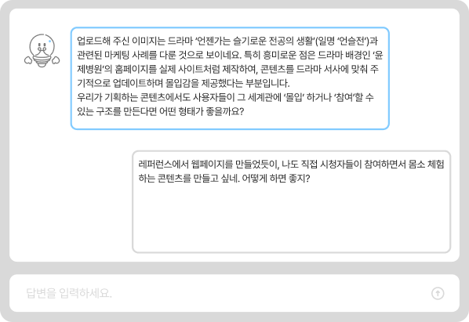

### Team 모아모아

  <h1> 💡아이디어가 떠오르지 않는 순간 Be Archieve</h1>
  
🔍 AI와 함께 아이디어가 떠오르지 않는 순간을 해결하는 브레인스토밍 도우미 🔍

 

  

 

## ✍️ 프로젝트 소개
현대사회는 정보 과잉으로 인해 창작자들이 아이디어를 도출하는 데 혼란과 부담을 느낍니다.
 **Be Archieve**는 단순한 레퍼런스 저장을 넘어 사용자의 생각을 확장시키는 AI 브레인 스토밍 서비스 입니다.
이를 통해 창작자·기획자·디자이너가 더 쉽게 아이디어를 발전시킬 수 있도록 돕습니다.

### 🔍 문제 정의
---
1. **비효율적인 정보 관리:**
- 레퍼런스가 여러 곳에 흩어져 있어 체계적인 정리와 재활용이 어렵습니다. 
2. **사고의 단절:**
- 방대한 정보는 오히려 혼란을 주며, 혼자 구상하는 과정에서 생각의 흐름이 쉽게 막힙니다.

3. **기존 도구의 한계:**
- 기존 레퍼런스 관리 플랫폼은 수집·저장 기능은 뛰어나지만, 저장된 콘텐츠를 아이디어로 발전시키는 기능이 부족합니다.

### 💡해결 방안

---

1. **레퍼런스 아카이빙:**
-  주제별 폴더를 생성해 레퍼런스를 체계적으로 관리할 수 있습니다.

 

     
   

2. **AI 기반 브레인스토밍:**
-  텍스트·이미지 등 수집한 레퍼런스를 AI가 분석하고, 사고를 확장시키는 질문을 자동으로 생성해 창작의 막힘을 해소합니다.

     
     
   

3. **사고 과정의 시각화:**
- AI와의 대화 및 아이디어를 워드클라우드 형태로 시각화해 사고 과정을 한눈에 파악하고 정리할 수 있습니다.
   

     
   

### 🏆프로젝트 목표
---

1. **창작 효율성 향상:**
- ‘레퍼런스 수집 → 사고 확장 → 시각화’로 이어지는 창작 플로우를 통합 제공해 창작 과정을 효율화합니다.
- 아이디어 발상에 어려움을 겪는 창작자들이 보다 능동적이고 전략적인 창작 활동을 할 수 있도록 지원합니다.

2. **사용자 경험 강화:**
- 직관적인 인터페이스와 시각화 기능을 통해 아이디어를 정리하는 행위 자체를 즐겁게 만듭니다. 

3. **확장 가능성 확보:**
- 구독형 요금제(무료/유료)를 기반으로 안정적인 수익 모델을 구축합니다. 
- 향후 광고 배너, 프리미엄 템플릿 판매 등 부가적인 수익 모델로 확장할 수 있는 기반을 마련합니다. 

## 🎥 시연영상

  <video src="https://raw.githubusercontent.com/HSU-BeArchive/asserts/refs/heads/main/BeArchieve%20.mp4" controls width="600"></video>

## 📚 기술 스택
### 프론트엔드
| 구분       | 기술                                                                                                                                          |
| -------- | ------------------------------------------------------------------------------------------------------------------------------------------- |
| 언어       |                                                                   |
| 프레임워크    |                                                                   |
| 스타일링     |                                                                  |
| 주요 라이브러리 |     |
### 백엔드

| 구분          | 기술                                       |
| ----------- | ---------------------------------------- |
| 언어          |                                   |
| 프레임워크       |                          |
| 빌드 도구       |                                    |
| 데이터베이스      |                                     |
| ORM         |                           |
| 클라우드        |                          |
| AI API      |                            |

